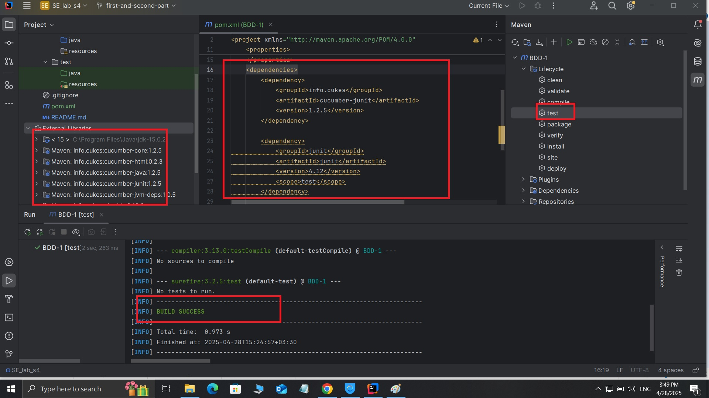
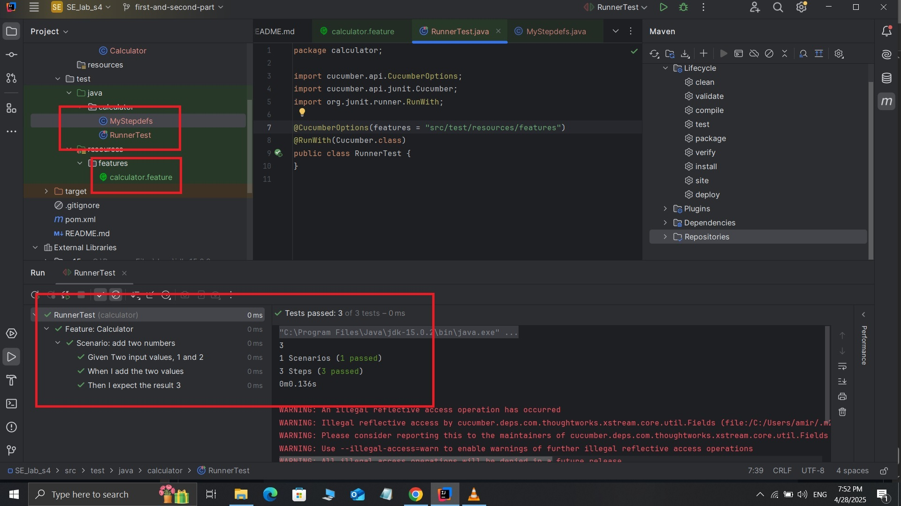
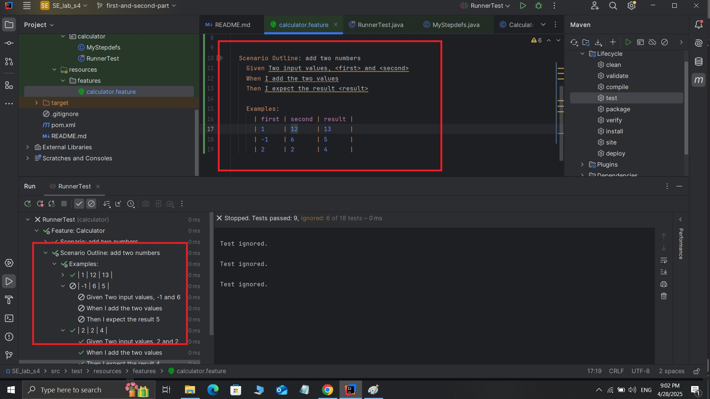
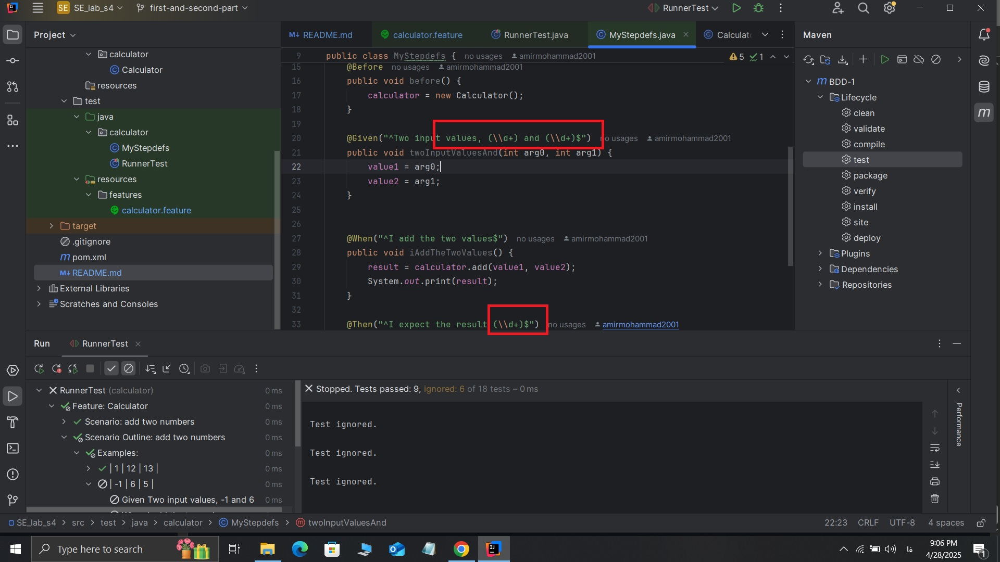
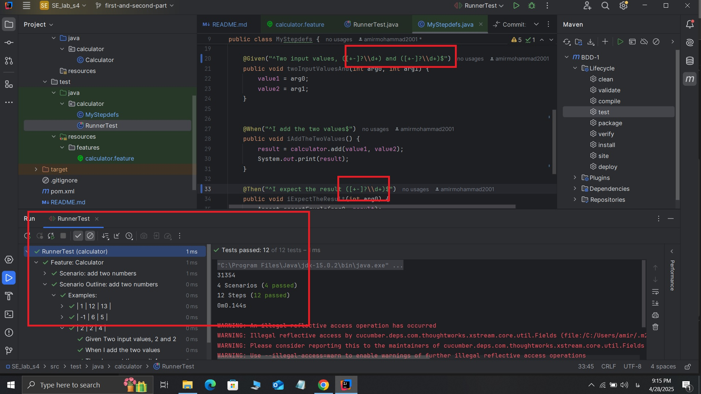

# گزارش بخش های اول و دوم آزمایش چهارم

* ابدا dependency ها را به پروژه اضافه کرده ایم.
* سپس تست را run کردیم و همانطور که مشاهده میکنید پیام BUILD SUCCESS در یافت کرده ایم.

همانطور که در تصویر بالا نیز مشاهده میکنید تمامی تنظینمات و فایل های مورد نیاز برای اجرای scenario معمولی انجام شده و تست ها به درستی پاس می شوند.

## اضافه کردن scenario outline

هنمانطور که در تصویر زیر مشاهده میکنید با اضافه کردن scenario outline به فایل feature خود باعث شدیم که یکی از تست ها ignore بشود.

دلیل ignore شدن تست این است که یکی از اعداد منفی است و ما در پارس کردن عبارت تست عدد منفی را به صورت regex در نظر نگرفته ایم.

همانطور که در تصویر بالا مشاهده میکنید این عبارت regex صرفا تعدادی عدد پشت سر هم را به قبول میکند و اگر این عداد علامت دار باشند آن ها را قبول نمیکند.

## حل مشکل

برای حل مشکل از اعبارت +d?[\+=]\ استفاده میکنیم که باعث میشود تا علامت قبل عدد نیز گرفته شود و  همانطور که در تصویر زیر نیز مشاهده میکنید مشکل تست حل شده است.

